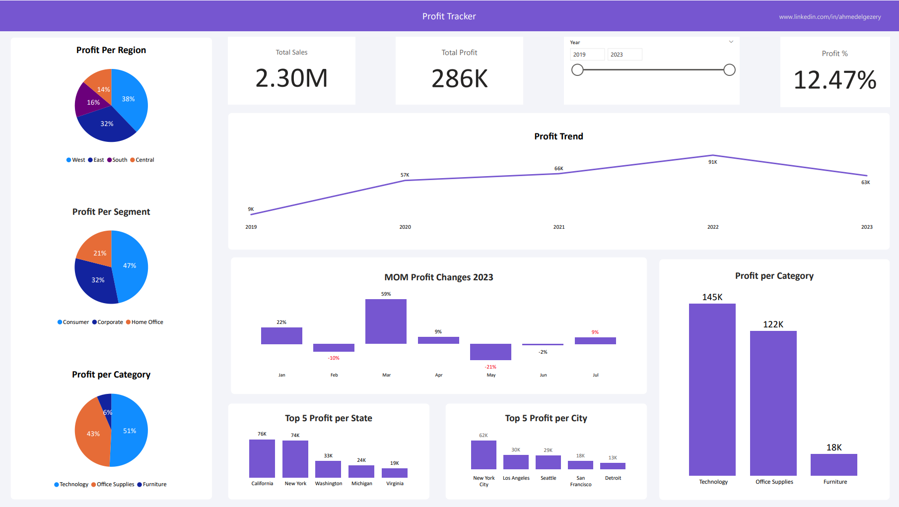

# Ahmed-El-Gezery-Portfolio
## About Me:
Hi, I'm Ahmed Gamal a Data Analyst with 2 years of experience, passionate about turning raw data into actionable insights. Constantly learning and exploring new techniques to enhance analysis and visualization skills.
## Portfolio
### Sales Dashboard (Jun-23)
> Description: This project aims to provide comprehensive insights into the company's activities, allowing stakeholders to explore various aspects of its operations. 

.png)

Second Page: Current Year Insights

> Profit Tracker.pngThis page provides a snapshot of the current year's events, offering stakeholders insights into ongoing developments. Designed for a quick overview, this slide provides concise information about the latest occurrences without delving into intricate details.

.png)

Third Page: Profit 

> Here, we present a quick overview of the company's profitability. Visualizations provide insights into profit margins, trends, and key drivers.

